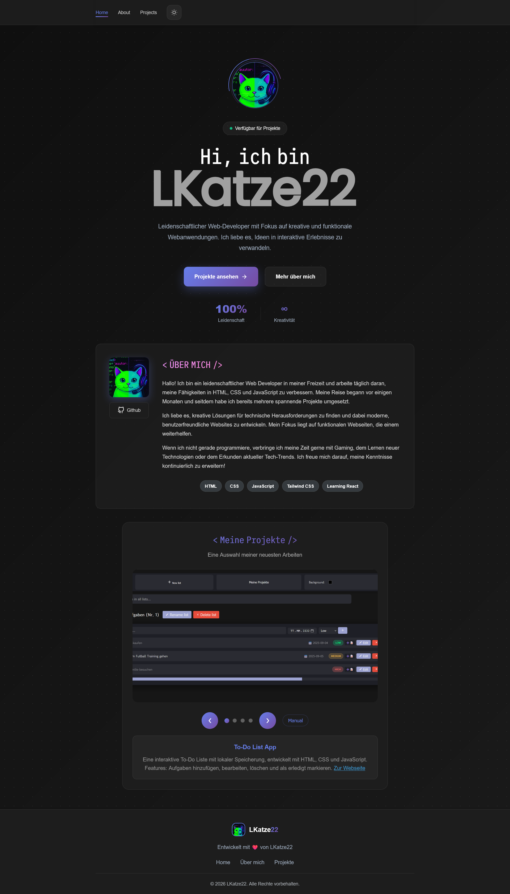

 My Portfolio

Welcome to my portfolio website! This is a showcase of my work, skills, and projects that I’ve crafted as a web developer. Visit the live site here: [My Portfolio](https://lkatz22.github.io).

## Features
- Responsive design for all screen sizes
- Projects gallery with previews and links
- Contact form powered by HTML and JavaScript

## Screenshot
2

## Technologies Used
- **HTML** - Structure and content
- **CSS** - Styling and visual layout
- **JavaScript** - Minor interactivity across the site

## How to Use
1. Clone the repository: `git clone https://github.com/LKatze22/LKatze22.github.io.git`
2. Open `index.html` in your browser to view it locally.

## License
Feel free to use this project as an inspiration or template.

If you reuse or share this site, please link back to me or credit it to LKatze22: https://github.com/LKatze22

---
Thank you for visiting my portfolio repository!

